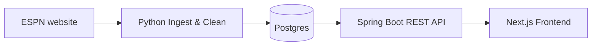
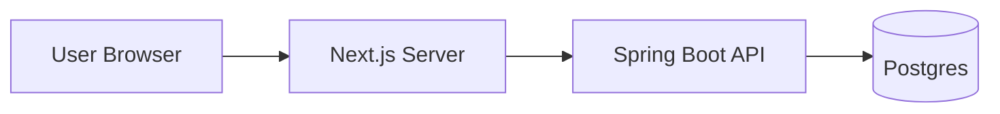

# ESPN stats to Postgres and API (ETL)

overview: "Design an end-to-end architecture: ingest NBA stats from ESPN, clean and store them in Postgres, expose them via a Spring Boot REST API, and consume them from a Next.js frontend."


# ESPN Stats → Postgres → API → Next.js

## High-Level Flow



1. **Python layer** (current project) is responsible for:

- Respectfully ingesting game data from ESPN.
- Cleaning / normalizing stats and derived metrics (ATS, O/U, etc.).
- Persisting that cleaned data into Postgres.

1. **Spring Boot backend** exposes a stable REST API over that data.
2. **Next.js frontend** calls the Spring API to render dashboards, game detail views, and search results.

---

## 1. Python Ingest & Clean Layer

**Repository:** your existing Python project (e.g. `espn-game-scraper`).

### 1.1 Modules and responsibilities

- `[src/config.py]` – configuration only:
  - ESPN base URLs, headers, timeouts, retry counts, min/max delays.
  - DB connection info is handled in `db.py` via `DATABASE_URL`.
- `[src/fetch_game.py]` – **ingest from ESPN**:
  - Uses `requests` to call ESPN’s **summary JSON endpoint** for a given `gameId`.
  - Handles retries, timeouts, and basic JSON sanity checks.
- `[src/parse_game.py]` – **raw parse**:
  - Takes summary JSON, extracts a minimal, raw game dict (teams, scores, date, referees, open lines).
  - No derived fields here; this is a faithful mapping to ESPN’s structure.
- `[src/main.py]` – **scraper runner**:
  - Builds a list/range of game IDs (e.g. 401810647–401810783).
  - For each ID: fetch summary → parse → write raw JSON to `data/<gameId>.json`.
  - Includes logging, respectful delays, and skip-if-already-scraped logic.
- `[src/clean.py]` – **single-game cleaner**:
  - Takes one raw game dict and returns a normalized dict with:
    .
    - Normalized status (`final`, `live`, etc.).
    - Safe `int`/`float` coercion.
    - Derived fields: `winner`, `loser`, `margin`, `total_points`, `ats_winner`, `ou_result`.
    - Friendly venue fields: `venue_name`, `venue_city`, `venue_state`
  - No I/O; pure function.
- `[src/run_cleaner.py]` – **batch cleaner + optional DB insert**:
  - Reads every `*.json` in `data/`.
  - For each file: `json.load()` → `clean_game_record()` → write to `data/cleaned/<gameId>.json`.
  - Optional `--db` flag to also call `insert_cleaned_game(cleaned)` per record.
- `[src/db.py]` – **Postgres adapter**:
  - `get_connection()` reads `DATABASE_URL` from `.env` (using `python-dotenv`).
  - `insert_game()` supports the legacy raw schema.
  - `insert_cleaned_game()` accepts the cleaned dict and writes into an enriched `nba_games` table (with derived columns like `winner`, `margin`, ATS/OU, etc.).

### 1.2 Database schema and migrations

- `[sql/create_table.sql]` – initial `nba_games` table for raw fields.
- `[sql/alter_nba_games_cleaned.sql]` – adds columns needed by the cleaned schema (winner, loser, margin, etc.).
- `[src/run_migrations.py]` – Python migration runner:
  - Reads both SQL files and executes them via `get_connection()`.

### 1.3 Operational flow (Python)

- **One-time setup:**
  - Set `DATABASE_URL` in `.env`.
  - Run `python -m src.run_migrations` to create/alter `nba_games`.
- **Regular ingest job (e.g. cron, manual):**
  1. `python -m src.main` → scrape raw games into `data/`.
  2. `python -m src.run_cleaner --db` → clean and insert into Postgres.

This separates scraping, cleaning, and DB write, but keeps them simple and testable.

---

## 2. Postgres Data Layer

**Role:** long-term storage and query engine for your stats.

### 2.1 Core table: `nba_games`

- Columns (raw + cleaned):
  - Identity and time: `game_id` (PK), `start_time_utc`, `scraped_at_utc`.
  - Teams/scores: `away_team`, `home_team`, `away_score`, `home_score`.
  - Status: `status` (normalized), legacy `game_status` for compatibility.
  - Venue: `venue_name`, `venue_city`, `venue_state`.
  - Officials: `referees` (TEXT[]).
  - Betting: `opening_spread_home`, `opening_spread_away`, `opening_total`, `ats_winner`, `ou_result`, `draftkings_lines` (JSONB).
  - Derived: `winner`, `loser`, `margin`, `total_points`.

### 2.2 Indexing

- Base indexes:
  - `PRIMARY KEY (game_id)`.
  - Indexes on frequent query fields you expect the API to use:
    - Date/time (`start_time_utc`).
    - Winner/teams (`winner`, `home_team`, `away_team`).
    - Derived stats if needed (e.g. `ats_winner`, `ou_result`).

This schema is flexible enough for the Spring API to answer most questions without joins (at least to start).

---

## 3. Spring Boot Backend (REST API)

**Goal:** provide a clean, versioned REST API over `nba_games` for the frontend.

### 3.1 Project layout (Spring Boot)

Suggested basic package structure:

```
backend/
  src/main/java/com/yourname/nbaapi/
    config/         # DB config if not using Spring Boot auto-configuration
    model/          # JPA entities or record DTOs
    repository/     # Spring Data JPA repositories
    service/        # Business logic, query composition
    controller/     # REST controllers (game endpoints)
```

### 3.2 Data access strategy

- Use **Spring Data JPA** or **Spring JDBC**:
  - JPA: define an `NbaGameEntity` mapped to `nba_games`, with fields matching the cleaned columns.
  - Repository interfaces like `NbaGameRepository` with methods:
    - `findByGameId(String gameId)`
    - `findByStartTimeUtcBetween(Instant start, Instant end)`
    - `findByHomeTeamOrAwayTeam(String team, String team)`

For complex queries (ATS/OU filters), you can add custom repository methods or use `@Query` annotations.

### 3.3 REST API design

Examples of endpoints:

- `GET /api/games/{gameId}` – single game detail (scores, lines, ATS/OU result, refs).
- `GET /api/games` – filtered list:
  - Query params: `date_from`, `date_to`, `team`, `status`, `winner`, `ats_winner`, `ou_result`, `limit`, `offset`.
- `GET /api/teams/{teamName}/games` – all games for a team over a time range.

Responses:

- Return JSON DTOs that closely mirror your cleaned game shape, with clear names and documented types.
- Use pagination for list endpoints.

### 3.4 Security and throttling

- Start with no auth for local development.
- Later: add API key or JWT auth layer and rate limiting if you expose it publicly.

---

## 4. Next.js Frontend

**Goal:** React + Next.js app that consumes the Spring API, not ESPN directly.

### 4.1 Data flow



- Next.js pages or API routes make `fetch`/`axios` calls to the Spring API.
- The Spring API talks to Postgres using JPA/JDBC.

### 4.2 Suggested Next.js structure

For an app router project:

```
frontend/
  app/
    page.tsx                 # Home/dashboard
    games/
      [gameId]/page.tsx      # Game detail page
      page.tsx               # Games list with filters
  lib/
    api.ts                   # Thin client for Spring API (fetch helpers)
  components/
    GameCard.tsx
    GameDetail.tsx
    FiltersBar.tsx
```

### 4.3 API integration examples

- **List games** (server component or client hook):
  - `GET http://localhost:8080/api/games?date_from=2026-03-01&date_to=2026-03-31&team=Lakers`
- **Single game page**:
  - `GET http://localhost:8080/api/games/401810777`

Next.js components render based on these responses; no direct knowledge of ESPN or Postgres.

---

## 5. Responsibilities and boundaries (summary)

- **Python ingest + clean (current repo)**
  - Owns: interaction with ESPN, raw parsing, cleaning rules, and DB insert.
  - Knows nothing about Spring or Next.js.
- **Postgres**
  - Owns: durable storage and relational querying.
  - Neutral about whether callers are Python jobs, Spring, or analytics tools.
- **Spring Boot API**
  - Owns: business-level query surface, pagination, filters, and auth.
  - Does not scrape ESPN; only reads Postgres.
- **Next.js frontend**
  - Owns: UX and visualization.
  - Talks only to the Spring API.

This layered architecture keeps each concern isolated and makes it easy to swap or evolve any layer (e.g., change the cleaner, add new tables, or add new API endpoints) without touching the others.
